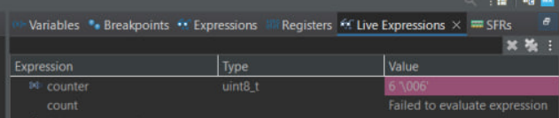
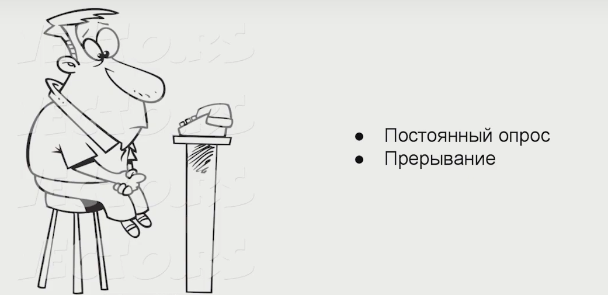

## Программный метод борьбы с дребезгом контактов 

**Настройки порта GPIOC:**
* Тактирование 
* Порт на вход (default)
* Подтяжка 
```C
RCC->AHB1ENR |= RCC_AHB1ENR_GPIOCEN; //RCC on for GPIOC
GPIOC->PUPDR |= GPIO_PUPDR_PUPD13_0; // pull_up
```
**Настройка внешних прерываний по спадающему фронту**
```C
RCC->APB2ENR |= RCC_APB2ENR_SYSCFGEN;
SYSCFG->EXTICR[3] |= SYSCFG_EXTICR4_EXTI13_PC ;
EXTI->IMR |= EXTI_IMR_MR13;
EXTI->FTSR |= EXTI_FTSR_TR13;
NVIC_EnableIRQ(EXTI15_10_IRQn);
```

**Обработчик прерывания**
```C
void EXTI15_10_IRQHandler(void){
		counter++;
		EXTI->PR |= EXTI_PR_PR13;

	}
```
>Крутимся в бесконечном цикле , как только отпустили кнопку, заходим в прерывание и увеличиваем счетчик.

Первым делом измерим сколько тактов занимает обработка прерываниий


<p align="center">
</<p align="center">


Значение счетчика DWT регистра показало 47 тактов. В программе используется тактирование по умолчанию от `HSI = 16MHz`, селодовательно 47 * (1/16000000) * 10<sup>6</sup> = 2,9375мкс


Выполянеяем 5 нажатий/отпусканий кнопки

<p align="center">
</<p align="center">

Сразу видно , что обработчик прерываний увеличил счетчик лишний раз , это свидетельствует о том , что произошел дребезг.

### Проверка на анализаторе 



В моменте нажатия дребезга выявлено не было , а в момент отпускания картина меняется 


В момент отпускания пришла целая пачка импульсов разной ширины 


Ширина данного импульса составляет 3 мкс , следовательно обработчик успел его зафиксировать. Как раз из-за него нас счетчик увеличился лишний раз.

Если посмотреть соседние импульсы, то их ширина меньше , чем время за которое обработчик успеет их обработать, поэтому в данном примере они игнорируются.


## Антидребезг по переполнению таймера 

Инициализация таймера 

```C
#define TIM_EnableIT_UPDATE(TIMx) SET_BIT(TIMx->DIER, TIM_DIER_UIE)
#define TIM_EnableCounter(TIMx) SET_BIT(TIMx->CR1, TIM_CR1_CEN)

RCC->APB2ENR |= RCC_APB2ENR_TIM10EN; // тактирование
NVIC_EnableIRQ(TIM1_UP_TIM10_IRQn); // глоб прерывания
TIM10->PSC = 16000; // предделитель
TIM10->ARR = 10; //значение регистра перезагрузки
```
Таймер будет прерываться каждые 10ms 

Видоизменяем обработчик внешнего прерывания 
```C
void EXTI15_10_IRQHandler(void){
			NVIC_DisableIRQ(EXTI15_10_IRQn); // запрещаем внешние прерывания 
			counter++;
			TIM_EnableCounter(TIM10); //запускаем таймер 
			DWT->CYCCNT = 0;
		 }
```
Обработчик по переполнению 
```C
void TIM1_UP_TIM10_IRQHandler(void){
			if(READ_BIT(TIM10->SR, TIM_SR_UIF)){
				CLEAR_BIT(TIM10->CR1, TIM_CR1_CEN); // остановили таймер
				EXTI->PR |= EXTI_PR_PR13;  //сбрасываем флаг внешнего прерыв.
				NVIC_ClearPendingIRQ(EXTI15_10_IRQn); //очистка pending бита
				NVIC_EnableIRQ(EXTI15_10_IRQn); //разрешили внеш. прерывания
				TIM10->SR &= ~TIM_SR_UIF; // сброс флага прерывания таймера
			}
	}
```
Как только отпустим кнопку, прерывание сработает и отключится в обработчике, так что дребезг нам уже не важен, прерывания отключены. Увеличиваем счетчик и запускаем таймер. Таймер через 10мс вызовет своё прерывание, там мы его остановим, а далее будут очищены нужные биты и включиться внешнее прерывание.

Повторно выполянеяем 5 нажатий/отпусканий кнопки

<p align="center">
</<p align="center">


Дребезга не произошло , счетчик посчитал верно 
### Проверка на анализаторе


Можем сделать вывод , что данный алгоритм позволил нам избежать ненужных срабатываний, которые произошли бы в первой программе.


