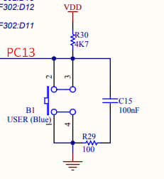
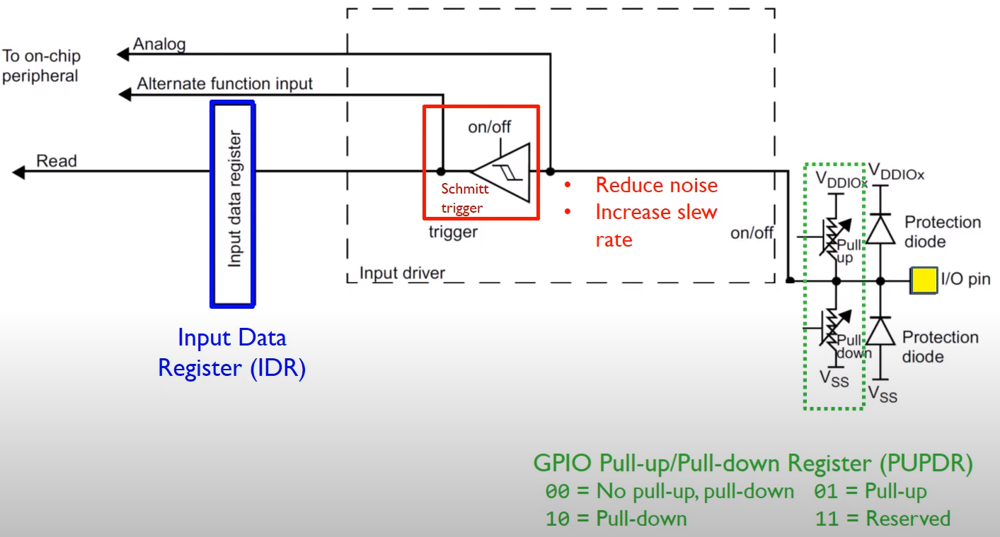
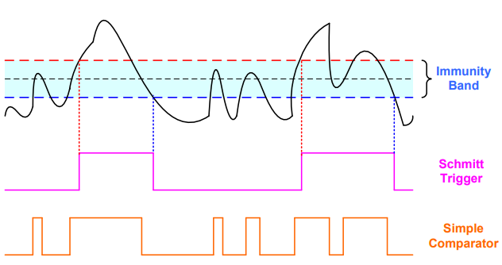
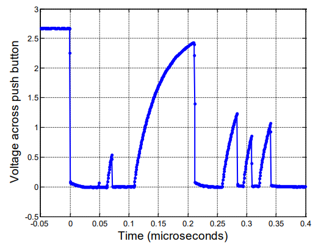

# Изучение явления дребезга контактов и анализ временных параметров сигналов клавиш
* NUCLEO-F401RE
 * STM32F401RET6U
 * ARM Cortex M4
 * CMSIS
 * STM32 CubeIDE v1.13.2

> В данном проекте зайдействована пользовательская кнопка B1, подключенная к порту PC13 по обратной логике.

 

## Конфигурация порта микрокнтроллера на вход 

 

Порт микроконтроллера может находится в трех состояниях: __высоком__, __низком__ и в состоянии __HiZ__ (высокоимпедансном)

## Принцип работы Триггера Шмитта 

 
 

## Явление дребезга контактов 
Дребезг представляет собой многократное замыкание и размыкание цепи. В результате на вход микропроцессорного устройства поступает не единичный перепад напряжения, а целая пачка импульсов. Примерная форма сигнала на таких контактах в момент замыкания показана на рисунке. 

 

 Методы борьбы:
* Аппаратные 
    * RC-цепочки
    * Антидребезговые микросхемы 
* Программные
    * Программная задержка 

